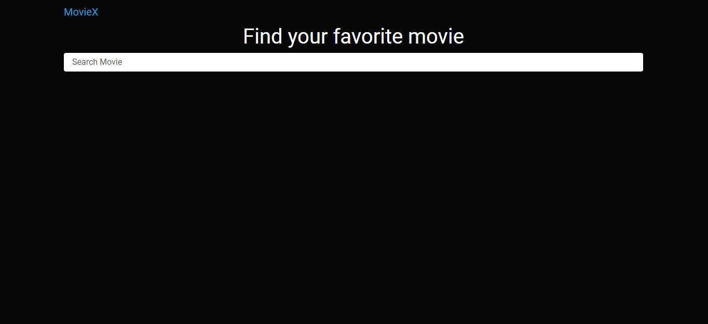
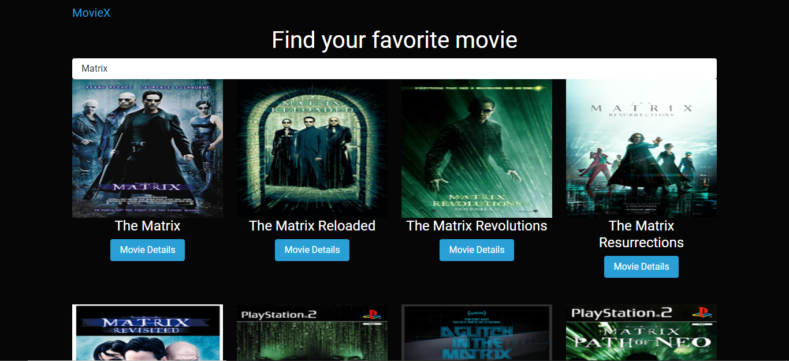
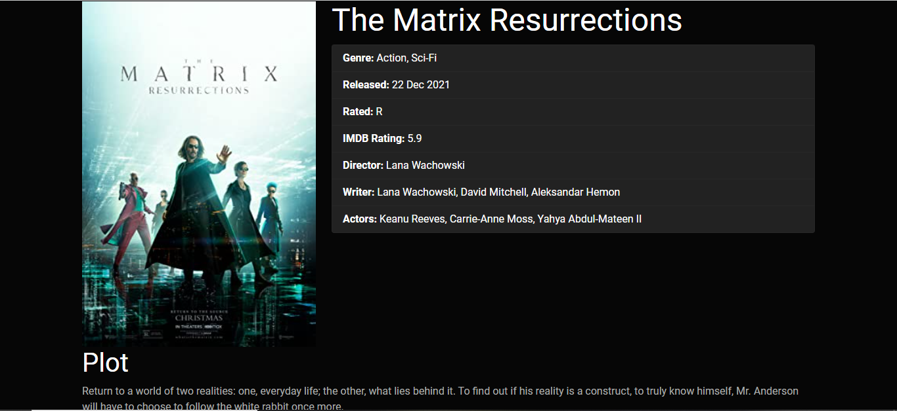

# MovieX

## Home Page

## Search Results Page
You can search any movie name and click on the **More Details** button then the Movie opens in details.

## Movie Details Page
You can click on the **View IMDB** button then view the movie details in IMDB page and click on the **Go Back To Search** button then the Home page will open.

### We can open the project in Live server.

## How to open live server from the terminal in VSCode?
First, you should verify that node.js is installed.

D:\MovieX> node -v

Then install the live-server package:

D:\MovieX> npm install -g live-server

If you still had issue related to (....ps1 cannot be loaded because running scripts is disabled on this system..... ) run this script in powershell:

D:\MovieX> Set-ExecutionPolicy -Scope CurrentUser -ExecutionPolicy Unrestricted

## To search omdb api you have to provide apiKey and also pass the same in the ajax request

example api http://www.omdbapi.com/?apikey=1234cae2&plot=short&t=Oceans

example ajax axios.get('http://www.omdbapi.com/?apiKey=1234cae2'+ '&t='+ searchText).then((response) => { console.log(response); })

The list of parameters to be passed is in the parameter sections http://www.omdbapi.com/

Note: I am separating url with the parameters so you can use whatever parameter you like id, title or search sting. Also jQuery does comes with an ajax api which also supports promises. So axios might be an extra load here.
